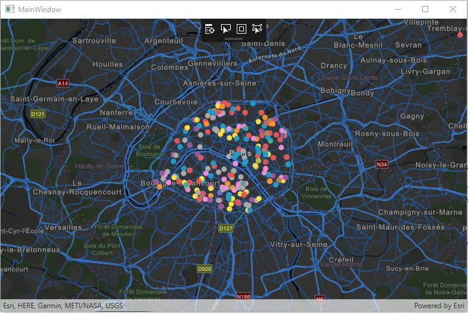

# SIG2022_ArcGIS_Runtimes_SDK_DotNET

Voici le code source de l'application de démonstration .NET vue lors de la présentation "Développer des applications natives avec ArcGIS Runtime APIs" du SIG 2022.

L'application est une simple fenêtre affichant une carte.
Le code source fourni permet au choix :
- d'afficher une couche à partir de son identifiant d'item ArcGIS Online ou ArcGIS Enterprise
- d'afficher une couche à partir de l'URI du service brut publié sur ArcGIS Online ou ArcGIS Enterprise

Le projet est une solution Microsoft Visual Studio 2017.

## Instructions

1. Ouvrir la solution ArcGISAppDemo2.sln.
2. Dans le fichier MapViewModel.cs :
- remplacer le texte 'ORGANISATION' par le nom d'hôte de l'organisation source de la couche, par exemple *orga*.maps.arcgis.com où *orga* est l'identifiant de votre compte développeur ArcGIS site [ArcGIS for Developers](https://developers.arcgis.com/).
- remplacer les textes 'IDENTIFIANT_COMPTE_DEVELOPPEUR' et 'MDP_COMPTE_DEVELOPPEUR' par l'identifiant et le mot de passe de votre compte développeur ArcGIS.
3. Au choix :
- Pour afficher une couche avec son identifiant d'item, décommenter le bloc de code commençant par le commentaire '//ITEM', puis remplacer 'IDENTIFIANT_ITEM' par l'identifiant de l'item de la couche à utiliser.
- Pour afficher une couche avec le service publié, décommenter le bloc de code commençant par le commentaire '//SERVICE', puis remplacer 'URI_SERVICE' par l'URI du service à utiliser.
4. Optionnel : si l'application doit être déployée, la licence doit êtré gérée dans le fichier App.xaml.cs. Si la licence LITE est suffisante pour votre utilisation :
- Décommentez la ligne de code sous"Gestion de la licence"
- Remplacer le texte 'CLE_LICENCE' par la clé de licence LITE de votre compte développeur ArcGIS.
5. Lancer l'application et contrôlez que :
- votre couche s'affiche
- le filigrane "Licensed For Developer Use Only" n'est pas affiché (si ce n'est pas le cas, alors il y a un problème de licence)

## Ressources

* [ArcGIS Runtime SDK for .NET](https://developers.arcgis.com/net/)
* [ArcGIS Blog](https://blogs.esri.com/esri/arcgis/)  
* [Esri Twitter](https://twitter.com/esri)

## Licence  

Copyright 2022 Esri France 

Licensed under the Apache License, Version 2.0 (the "License"); you may not 
use this file except in compliance with the License. You may obtain a copy 
of the License at

http://www.apache.org/licenses/LICENSE-2.0

Unless required by applicable law or agreed to in writing, software 
distributed under the License is distributed on an "AS IS" BASIS, WITHOUT 
WARRANTIES OR CONDITIONS OF ANY KIND, either express or implied. See the 
License for the specific language governing permissions and limitations 
under the License.

A copy of the license is available in the repository's license.txt file.